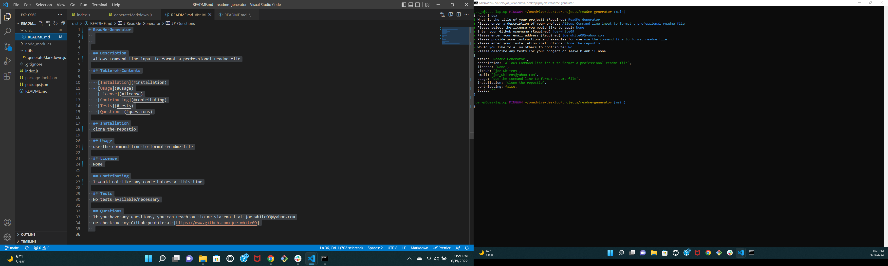
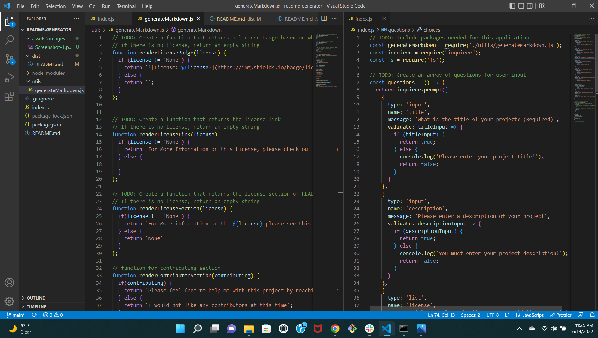

# Readme-Generator
  
  

## Description
This is a node.js application to fill out a professional readme.md file through command line input

## Table of Contents

- [Installation](#installation)
- [Usage](#usage)
- [Screenshots-and-video](#screenshots-and-video)
- [License](#license)
- [Contributing](#contributing)
- [Contributors](#contributors)
- [Tests](#tests)
- [Questions](#questions)

## Installation
First, clone this repository. Then run the command 'npm install'. Once that is complete, run the command 'node index.js'. This will prompt the user with questions on the command line. Answer these questions and you will have a professional readme.md file created according to your answers

## Usage
By using this application, easily format a professional readme file by answering the prompts

## Screenshots and video

## License
For More information on the MIT please see this link For More Information on this License, please check out this link (https://opensource.org/licenses/MIT)

## Contributing
Please feel free to help me with this project by reaching out to me via email or through my GitHub account

## Contributors
- Joe White
- Vanderbilt University Coding BootCamp starter code

## Tests
No tests available/necessary

## Questions
If you have any questions, you can reach out to me via email at joe_white09@yahoo.com
or check out my Github profile at [https://www.github.com/joe-white09]
  
